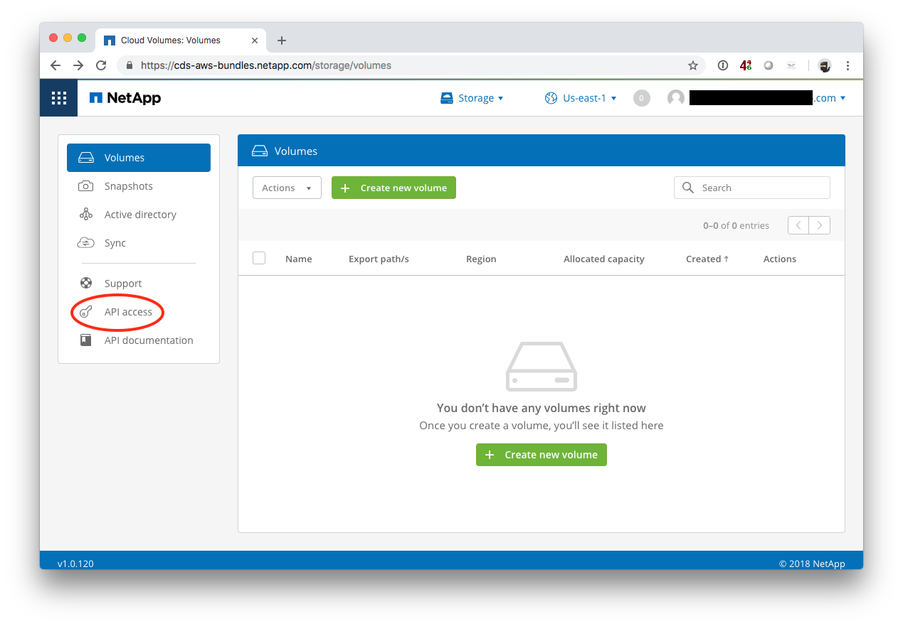
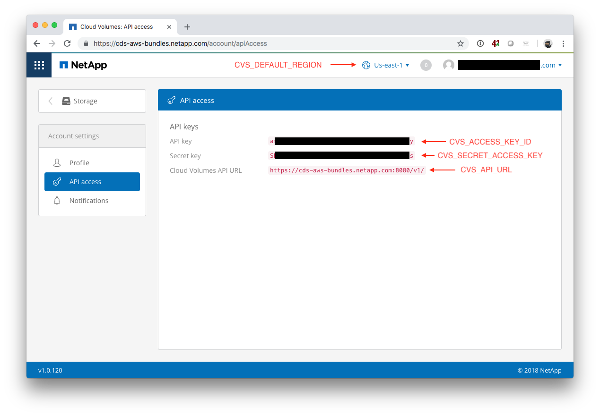

# Using NetApp Cloud Volume Services (CVS) API

## Overview
tl;dr: Some command line examples on how to use CVS API to programmatically create, modify, clone and delete CVS volumes.

Longer: You need a shared POSIX filesystem in AWS? You need a fast and reliable NFS or SMB/CIFS share? CVS is the solution. Lets assume you have put your workload (e.g. a database) on a CVS NFS share, what next? Create instant snapshots of your data for backup and recovery or clone your database for dev/test. Of course you want to automate this. Here is sample code on how to use the API.

## What is Cloud Volume Services (CVS)?
Basically it is a NAS (NFS/SMB) share for your workloads running in AWS. It can do instant, space efficient snapshots and clone your volume in a snap ;) For more info, head to https://cloud.netapp.com/cloud-volumes-service.

## API stuff
* Here is the offical link to the API documentation:
https://docs.netapp.com/us-en/cloud_volumes/aws/reference_cloud_volume_apis.html
* The complete API documentation is here: https://app.swaggerhub.com/apis/NetApp-Cloud/c-vaa_s
* I recommend using the "API documentation" link from the CVS UI. It will guide you to the API documentation that your environment is using.

## How to use?
1. Obtain access to CVS. See https://cloud.netapp.com/cloud-volumes-service for details.
2. After you have access, fetch the API details for the following variables from the CVS management UI and modify it in cvs.sh:
```bash
export CVS_ACCESS_KEY_ID=your_access_key
export CVS_SECRET_ACCESS_KEY=your_secret_key
export CVS_API_URL='https://your_API_endpoint:8080/v1/'
export CVS_DEFAULT_REGION=your_CVS_region
```

You will find the required information here:


3. Run ./cvs.sh. Look at the comments. It is meant to be used as copy/paste toolbox.

## Requirements
To run the script successfully, you need the following tools installed:
* Python3
* jq https://stedolan.github.io/jq/
* curl https://curl.haxx.se/

Homebrew convenience: brew install python3 curl jq
